# Dormitory DB ERD

## Danh sach collection

`User`, `Area`, `Room`, `Application`, `Registration`, `Contract`, `Bill`, `Service`, `ServiceRegistration`, `ServiceUsage`, `RoomService`, `RoomMonthlyCost`, `RoomRating`, `Notification`, `RegistrationPeriod`, `ContractExtendRequest`, `ContractExtensionSetting`, `MaintenanceReport`, `DamageReport`, `Violation`, `ViolationRule`, `Facility`, `FacilityLocation`, `FacilityReport`, `LaundryUsage`.

## Quan he chinh

- `Area.manager -> User`
- `User.managedArea -> Area`
- `Room.area -> Area`
- `Room.roomLeader -> User`
- `Application.user -> User`
- `Application.preferenceArea -> Area`
- `Application.assignedRoom -> Room`
- `Application.reviewedBy -> User`
- `Application.linkedContract -> Contract`
- `Registration.user -> User`
- `Registration.room -> Room`
- `Registration.fromRoom -> Room`
- `Registration.currentContract -> Contract`
- `Registration.reviewedBy -> User`
- `Contract.registration -> Registration`
- `Contract.application -> Application`
- `Contract.user -> User`
- `Contract.room -> Room`
- `Contract.studentConfirmedBy/createdBy/paymentConfirmedBy/adminReviewedBy/signedPdfUploadedBy -> User`
- `Bill.contract -> Contract`
- `Bill.user -> User`
- `Bill.room -> Room`
- `Bill.violation -> Violation`
- `Bill.commonServiceBreakdown[].service -> Service`
- `Bill.personalServiceBreakdown[].service -> Service`
- `Bill.paymentHistory[].performedBy -> User`
- `ServiceRegistration.user -> User`
- `ServiceRegistration.service -> Service`
- `ServiceUsage.room -> Room`
- `ServiceUsage.service -> Service`
- `ServiceUsage.enteredBy -> User`
- `LaundryUsage.user -> User`
- `LaundryUsage.service -> Service`
- `RoomService.room -> Room`
- `RoomService.service -> Service`
- `RoomMonthlyCost.room -> Room`
- `RoomMonthlyCost.enteredBy -> User`
- `RoomRating.room -> Room`
- `RoomRating.user -> User`
- `Notification.user -> User`
- `ContractExtendRequest.contract -> Contract`
- `ContractExtendRequest.user -> User`
- `ContractExtendRequest.reviewedBy -> User`
- `MaintenanceReport.user -> User`
- `MaintenanceReport.room -> Room`
- `DamageReport.user -> User`
- `DamageReport.room -> Room`
- `Violation.rule -> ViolationRule`
- `Violation.user -> User`
- `Violation.room -> Room`
- `Violation.bill -> Bill`
- `Violation.resolvedBy -> User`
- `Violation.recordedBy -> User`
- `FacilityLocation.facility -> Facility`
- `FacilityLocation.area -> Area`
- `FacilityLocation.room -> Room`
- `FacilityReport.facility -> Facility`
- `FacilityReport.room -> Room`
- `FacilityReport.reportedBy -> User`

## ERD Mermaid

```mermaid
erDiagram
  USER ||--o{ APPLICATION : submits
  USER ||--o{ REGISTRATION : creates
  USER ||--o{ CONTRACT : signs
  USER ||--o{ BILL : billed_to
  USER ||--o{ SERVICEREGISTRATION : registers
  USER ||--o{ LAUNDRYUSAGE : uses
  USER ||--o{ NOTIFICATION : receives
  USER ||--o{ ROOMRATING : rates
  USER ||--o{ MAINTENANCEREPORT : reports
  USER ||--o{ DAMAGEREPORT : reports
  USER ||--o{ VIOLATION : involved
  USER ||--o{ CONTRACTEXTENDREQUEST : requests

  AREA ||--o{ ROOM : contains
  AREA ||--o{ FACILITYLOCATION : has

  ROOM ||--o{ CONTRACT : assigned
  ROOM ||--o{ REGISTRATION : requested
  ROOM ||--o{ BILL : billed
  ROOM ||--o{ ROOMSERVICE : has
  ROOM ||--o{ ROOMMONTHLYCOST : monthly_cost
  ROOM ||--o{ SERVICEUSAGE : meter_usage
  ROOM ||--o{ ROOMRATING : gets
  ROOM ||--o{ MAINTENANCEREPORT : has
  ROOM ||--o{ DAMAGEREPORT : has
  ROOM ||--o{ VIOLATION : occurs
  ROOM ||--o{ FACILITYLOCATION : location
  ROOM ||--o{ FACILITYREPORT : has

  SERVICE ||--o{ SERVICEREGISTRATION : selected
  SERVICE ||--o{ SERVICEUSAGE : metered
  SERVICE ||--o{ ROOMSERVICE : mapped
  SERVICE ||--o{ LAUNDRYUSAGE : usage_log

  CONTRACT ||--o{ BILL : generates
  CONTRACT ||--o{ CONTRACTEXTENDREQUEST : extend_request

  VIOLATIONRULE ||--o{ VIOLATION : defines
  VIOLATION o|--|| BILL : penalty_bill

  FACILITY ||--o{ FACILITYLOCATION : placed
  FACILITY ||--o{ FACILITYREPORT : reported
```

